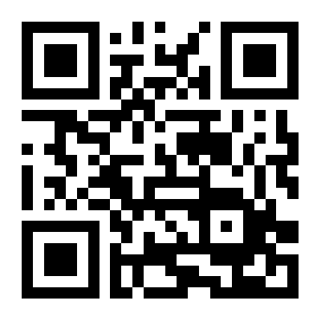

# ImageShare

ImageShare is a web app for sending images and videos to another device, designed for low-end and legacy web browsers. It works with Internet Explorer, the Nintendo 3DS and Wii U browsers, KaiOS, Netscape, and many other browsers. When you upload a file, ImageShare will generate a QR code for downloading it on another device.

ImageShare was originally designed as a replacement for the [Nintendo 3DS Image Share Service](https://web.archive.org/web/20170822055326/https://www.nintendo.com/3ds/image-share). It supports both HTTP and HTTPS, doesn't require creating user accounts, and uses a static web design for the fastest possible performance. When uploading a game image from the Nintendo 3DS and Nintendo Wii U, the game title is detected and added to the file's EXIF data for easy search.

You can [self-host ImageShare](DEV.md) on any server, NAS, home computer, or other device using Docker.

### How to use ImageShare

The main ImageShare server is hosted at [theimageshare.com](http://theimageshare.com/). If your device can scan QR codes with a camera, scan the below QR code to open it. The site uses an non-secure HTTP connection by default for best compatibility, but your data is not encrypted in transit.

**Nintendo console users:** You can scan QR codes with the Nintendo 3DS by pressing the L + R buttons on the home screen, then pressing the QR code button. If you can't connect, check that the date and time is correct on your device, then try again.

Once you have ImageShare open, bookmark it or add it to your home screen for easy access. Nintendo 3DS users can tap the star button in the browser to save it.

If you have a more modern browser or device that supports the [Let's Encrypt ISRG Root X1 certificate](https://letsencrypt.org/docs/certificate-compatibility/), you can use ImageShare over an encrypted HTTPS connection. You can try it by opening `https://theimageshare.com` instead of `http://theimageshare.com`.

### Privacy Policy & Terms of Service

ImageShare uses [Plausible Analytics](https://plausible.io) to report anonymous usage data, including how many times the app is used and the browser/device used. Uploaded images are only stored on ImageShare servers until the upload to the third-party service is complete, then the copy on ImageShare is deleted. The QR code is generated using the [goQR.me API](https://goqr.me/api/), which requires sending the URL to goQR.me after upload.

### Credits

Game title detection uses [3dsdb by hax0kartik](https://github.com/hax0kartik/3dsdb) for Nintnedo 3DS games, and [WiiUBrew title database](https://wiiubrew.org/wiki/Title_database) for Nintendo Wii U games. The ImageShare icon and logo is based on [Cloud arrow up fill](https://icons.getbootstrap.com/icons/cloud-arrow-up-fill/) from Boostrap Icons. Custom robots.txt file for blocking AI crawlers provided by [ai.robots.txt](https://github.com/ai-robots-txt/ai.robots.txt).