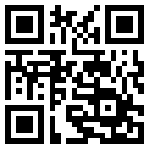

# ImageShare

ImageShare is a web app for sending images and videos to another device, designed for low-end and legacy web browsers. It works with Internet Explorer, the Nintendo 3DS and Wii U browsers, KaiOS, Netscape, and many other devices and browsers. When you upload a file, ImageShare will generate a QR code and shortlink for downloading it on another device.

ImageShare was originally designed as a replacement for the [Nintendo 3DS Image Share Service](https://web.archive.org/web/20170822055326/https://www.nintendo.com/3ds/image-share). It supports both HTTP and HTTPS, doesn't require creating user accounts, and uses static web design for the fastest possible performance. When uploading a game image from the Nintendo 3DS and Nintendo Wii U, the game title is detected and added to the file's EXIF data for easy search.

You can [self-host ImageShare](DEV.md) on any server, NAS, home computer, or other device using Docker.

## How to use ImageShare

The main ImageShare server is hosted at [theimageshare.com](http://theimageshare.com/). If your device can scan QR codes with a camera, scan the below QR code to open it. The site uses a non-secure HTTP connection by default for best compatibility, but your data is not encrypted in transit.

**Nintendo 3DS users:** Press the L + R buttons on the home screen, press the QR code button, then scan the below code. After opening, tap the star button in the browser to save it as a bookmark.

Once you have ImageShare open, bookmark it or add it to your home screen for easy access. If you have a more modern browser or device that supports the [Let's Encrypt ISRG Root X1 certificate](https://letsencrypt.org/docs/certificate-compatibility/), you can use ImageShare over an encrypted HTTPS connection. You can try it by opening `https://theimageshare.com` instead of `http://theimageshare.com`.

You can also force the small-screen mobile layout by navigating to the `/m/` page. This is useful for old phones, PDAs, and other small devices that can't switch automatically.

## Privacy Policy & Terms of Service

The main ImageShare server stores uploaded files for a brief a period of time displayed on the upload result, then the files are permanently deleted. It also uses [Plausible Analytics](https://plausible.io) to transmit and store anonymous usage data. See the [Privacy Policy](PRIVACY.md) for more information.

## Credits

Game title detection uses [3dsdb by hax0kartik](https://github.com/hax0kartik/3dsdb) for Nintnedo 3DS games, and [WiiUBrew title database](https://wiiubrew.org/wiki/Title_database) for Nintendo Wii U games. The ImageShare icon and logo is based on [Cloud arrow up fill](https://icons.getbootstrap.com/icons/cloud-arrow-up-fill/) from Boostrap Icons. Custom robots.txt file for blocking AI crawlers provided by [ai.robots.txt](https://github.com/ai-robots-txt/ai.robots.txt).
